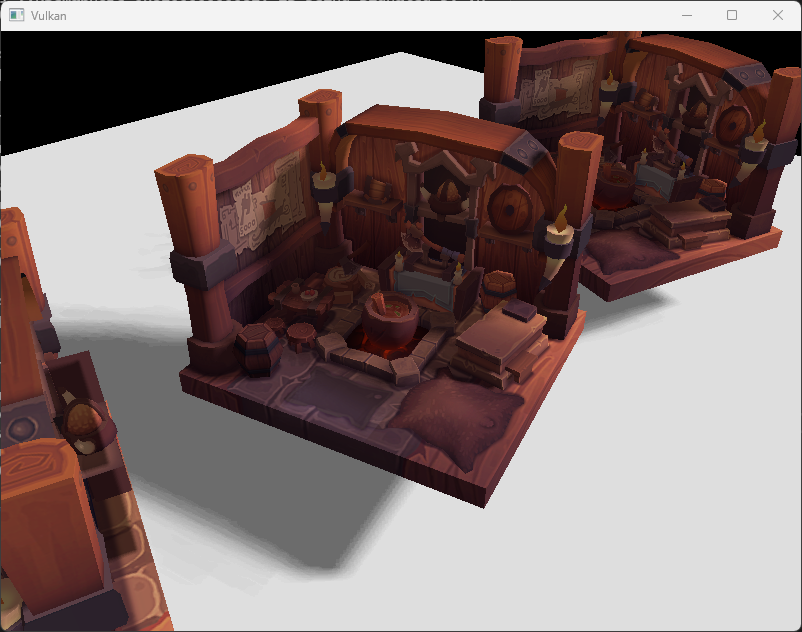

# MyVulkanEngine

基于 **Vulkan** 与 **GLFW** 的轻量级渲染示例工程：交换链、深度测试、纹理采样、OBJ 网格加载，以及带 **PCSS（Percentage-Closer Soft Shadows）** 的方向光阴影与主通道前向渲染。

## 效果图



> 可将更多截图放在 [`resource/`](resource/) 目录下，并在本节补充引用，例如：``。

## 功能概览

- **RHI**：实例、设备、队列、交换链、同步对象
- **渲染**：双 Pass（阴影深度 Pass + 主 Pass）、动态 Viewport / Scissor
- **阴影**：2048 分辨率深度贴图，片元阶段 PCSS（Poisson 采样 + 可变半径 PCF）
- **资源**：`stb_image` 纹理、`tiny_obj_loader` 模型、每材质描述符集（漫反射贴图）

## 环境要求

- Windows（当前工程在 Win32 上验证）或同等支持 Vulkan 的平台
- [Vulkan SDK](https://vulkan.lunarg.com/)（需包含 `glslc` 用于着色器编译）
- **CMake** 3.20 及以上
- 支持 **C++17** 的编译器（如 MSVC）

构建时通过 **FetchContent** 自动获取 **GLFW 3.4** 与 **GLM 1.0.1**，无需手动安装。

## 构建与运行

```bash
cmake -B build
cmake --build build --config Release
```

可执行文件位于 `build/bin/Release/`（或单配置生成器下的 `build/bin/`）。  
构建完成后会把 `shaders/`（SPIR-V）与 `assets/` 复制到可执行文件同级目录；请从该目录运行程序，或保证工作目录能解析相对路径 `shaders/*.spv` 与 `assets/...`。

默认资源路径在源码 [`src/rhi/VulkanTypes.h`](src/rhi/VulkanTypes.h) 中配置（如 `assets/models/`、`assets/textures/`）。

## 仓库结构（节选）

```
MyVulkanEngine/
├── assets/              # 模型与纹理（构建时复制到输出目录）
├── cmake/               # CMake 辅助脚本（着色器编译等）
├── resource/            # 文档用效果图、说明图等（不参与构建）
├── shaders/             # GLSL 源码（.vert / .frag）
├── src/
│   ├── core/            # 窗口
│   ├── rhi/             # Vulkan 上下文、交换链、图像工具
│   ├── renderer/        # 管线、渲染器、阴影
│   └── resource/        # 网格与纹理加载
├── CMakeLists.txt
└── README.md
```

## 许可证

若仓库根目录未单独提供许可证文件，默认以仓库所有者的声明为准；引用第三方库（GLFW、GLM、stb、tinyobjloader 等）请遵循其各自许可证。
